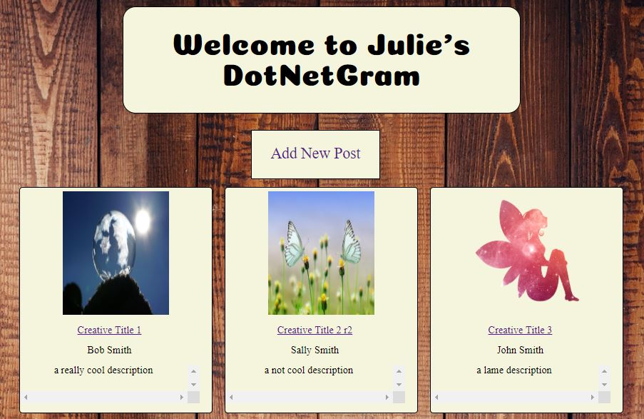
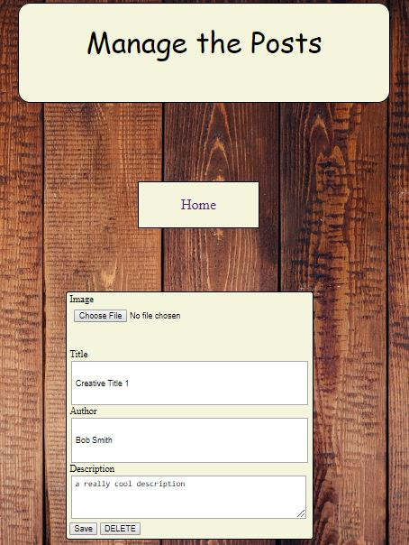
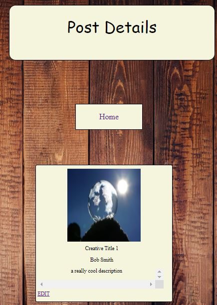
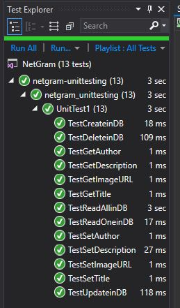

# Lab14_15-NetGram
We were asked to create a website similar to InstaGram, where a user could add/update/delete a Post. A Post includes an image, the author or username, and a description.

You can find my application at: https://jlynetgram2.azurewebsites.net

## Solution
Here is an example of the "Home" page, where one would see all the entries: 

Here is an example of the adding page, where you choose your image file, and fill out the form: 

Here is an example of the details page, where you can view the specific details of the post: 

## Design
For the Design, I chose to have all the images on the main/home page. Then have two other pages, one for viewing the details, and one for adding/editing a post.
I also utilized Dependency Injection for a buffer between the program and the Database.
I used one class for my objects, essentially the Post object, which contained the information like Author, Description, and URL link.

## Technologies
I utilized the following technogies: 
- Razor Pages (to create the site)
- Azure Blob (to store images)
- Azure Application (to deploy the site)
- VS Xunit (for testing)

## Recognition
Used Pixabay for all images on my site: https://pixabay.com/en/

<!--
spent about 14.5 hours to complete this assignment
-->

